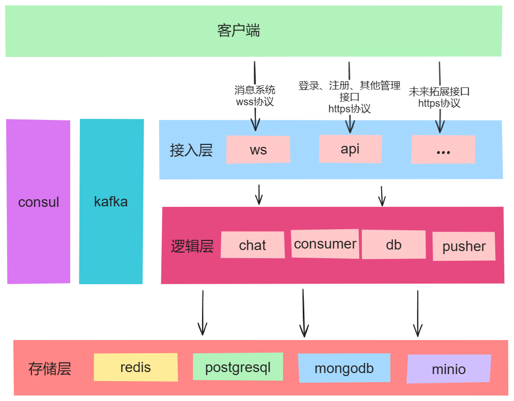

# 使用Rust手把手一起实现一个分布式im应用1--后端架构说明

### 前言

上一篇文章介绍了项目所包含的所有内容，但是非常笼统，因此这篇文章主要介绍后端的架构，为我们后续手把手一起实现一个分布式im应用做铺垫。

### 架构图

### 架构构成：

整个架构由我们自己编写的六个服务以及6个第三方组件构成

#### 自己实现：

- ws：websocket服务、用于管理客户端链接，实现消息的收发

- chat：用来生成消息的server_id、send_time然后将消息发布到卡夫卡

- consumer：kafka的消费者，用来将消息推送到database service以及pusher服务中

- db：database service， 用来将消息存入到postgres和mongodb中

- pusher：用来将消息推送到ws服务中

- api服务，用来提供http请求接口采用restFUll风格

  前五个服务能够形成一个消息发送的完整链路，服务之间全部采用Grpc的方式进行通信。

#### 第三方组件

- redis：用来做缓存，主要缓存用户的消息序列号和群聊成员的id

- kafka：消息队列，实现消息的异步发送，将整体架构的解耦

- consul：注册中心，用来管理所有的服务，检测服务的健康状况

- postgres：保存用户信息、群聊信息、好友信息以及消息历史记录

- mongodb：消息收件箱

- minio：用来存储用户发送的文件类型的消息。

  由于我们依赖了比较多的第三方组件，在开发的时候这些组件的管理就会成为我们的额外负担，因此使用docker进行管理，在项目中也提供了一个docker-compose的配置，可以直接使用一条命令docker-compose up -d就可以全部启动了。

### 架构优势

由于我们所有服务之间的数据交流都是无状态的，而且加入了kafka将消息收发两大部分进行了异步解耦，因此我们的每个服务是可以横向弹性部署的，由于kafka本身topic以及消费组的概念，天然支持同一个topic同一个消费者组多个消费者不会重复消费消息的特性，我们就可以部署多个消费者，来减缓每个消费者实例的压力。同时每个服务都有一个运行期动态刷新所依赖服务列表的能力，如此一来就可以在项目运行期间进行动态部署。

### 关键问题

在即时通讯（IM）系统的设计中，实时性、可靠性和有序性是三个至关重要的服务质量（QoS）指标。

首先，**实时性**要求系统能够迅速地处理和传递信息，以便用户能够体验到近乎同时的沟通。其次，**可靠性**确保了信息在传递过程中不会丢失，即使面临网络问题和其他的技术挑战也能保证信息的完整送达。最后，**有序性**保证了信息按照它们被发送的顺序接收，确保了对话内容的连贯性和上下文的完整性。

**解决方案：**

- 实时性：客户端与服务端基于websocket协议进行连接，能够实现服务端主动向客户端推送消息，因此能够在用户收到消息的第一时间将消息推送给用户

- 有序性和可靠性：整个消息发送与接收是基于服务端的推（websocket主动推）和客户端的拉（客户端端主动向服务器拉取）进行设计的。用户消息发送成功与否是可控的，因为如果发送失败服务器会返回一个发送结果的消息给客户端（这快后面会详细的说），因此我们只需要保证用户能百分百收到消息即可，为了解决这个问题，我们采用收件箱的设计，即用户发出消息后，消息会根据目标用户id存入到该用户的收件箱，（其实就是存入到mongodb中，收件箱的说法只是为了更好的理解），每个用户的收件箱中的消息一定都是有序的，因此每个用户的收件箱中的每条消息都是有序号的，我们只需要为每个用户维护一个收件箱序列号即可保证用户一定是有序的而且一定能收到消息，那么如何保证呢？这个需要客户端进行配合，当用户登录时会向服务器获取用户最新的序列号，然后比对本地序列号，如果相同那么说在用户离线期间没有收到消息；如果服务端序列号大于本地序列号那么说明在离线期间收到了消息，客户端只需要根据两个序列号向服务端拉取消息即可；如果服务端序列号比本地序列号小，那说明本地数据异常，将本地序列号与服务端序列号对齐即可，这种情况正常来说是不会发生的。同时用户在线期间每次收到消息都会比对本地序列号与消息携带的序列号，如果存在断层，即如果收到的消息序列号减去本地序列号的值超过了1，那么说明存在消息漏收，这时候会触发消息补齐机制，客户端根据两个序列号向服务器拉取漏收的消息，将本地消息补齐。还有一种情况是客户端一条消息收到多次，客户端会将local_id作为唯一索引，收到消息进行入库时会执行put操作，如果数据库中不存在那么会执行插入操作，如果数据库中已经存在了那么执行更新操作，这样就完美避开了一条消息重复收取的问题。这样通过客户端与服务端共同协作下就保证了消息的有序性于可靠性。

消息收发完整流程说明

- 时序图

  

- 当客户端a向客户端b发送消息时，完整的流程是这样的：消息通过websocket协议发送到ws服务中，ws通过grpc请求chat服务，chat服务会生成消息的server_id以及send_time然后将消息发布到kafka，发布成功我们就认为这条消息发送成功了，然后ws服务会给用户a返回一个消息发送结果的websocket消息，客户端a再根据这个结果消息中的local_id更新本地消息的server_id、send_time并且将发送状态修改为发送成功。如果发送失败同样会返回一个包含了失败信息的websocket消息，客户端会将该消息标记为发送失败，并且通过ui通知用户该消息发送失败。这样流程的前半段--消息发送阶段就完成了。

- 因为引入了kafka实现了消息发送的解耦，所以在卡夫卡的消费端有一个consumer服务会不停的消费卡夫卡中的消息，consumer会做三件事情，首先会根据消息中的目标用户id增加该用户的收件箱序列号，这块使用了redis中的incr命令，因为这个命令是原子操作，所以也不需要考虑并发的问题，这块redis提供了非常大的便利。然后consumer会将消息分别通过grpc的方式发送给db服务和pusher服务，db服务将消息存如postgres作为历史记录，存入mongodb作为消息收件箱。pusher服务只需要根据消息是群聊还是单聊通过grpc调用ws服务的相关接口将消息发送到ws服务即可，最后ws会将消息通过websocket推送给客户端b，至此我们就实现了消息从客户端a发送到客户端b的全部流程。

以上是目前后端整体架构的详细说明，接下来我会带领大家一起动手从零实现一个分布式、可弹性动态拓展的im应用
